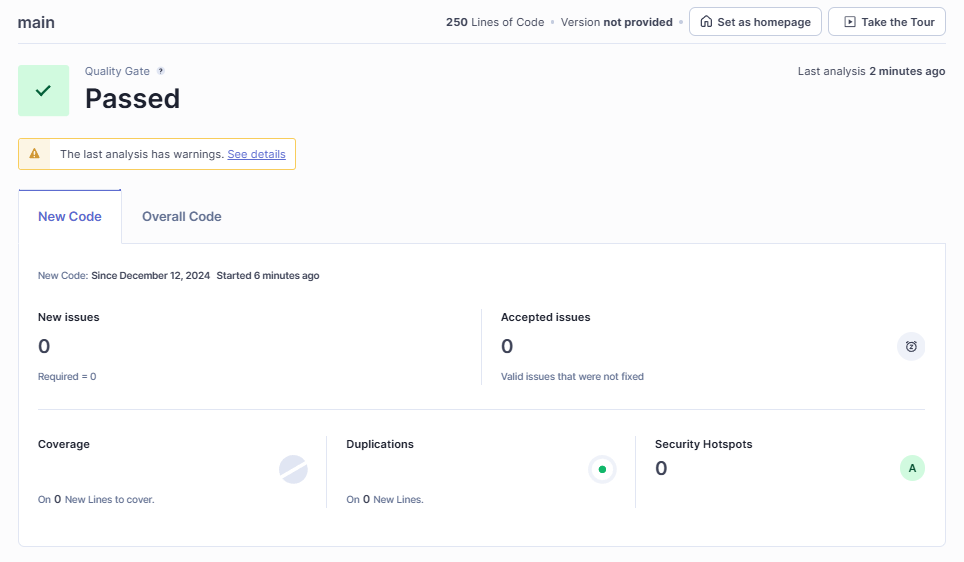

# Task Manager - Flask Application

## Descripción

Esta es una aplicación de gestión de tareas construida con **Flask** y **SQLAlchemy**. Permite agregar, marcar como completadas, eliminar y guardar tareas en un archivo JSON. Además, se pueden cargar tareas desde un archivo JSON. La aplicación usa **SQLite** como base de datos para almacenar las tareas.

## Características

- **Agregar tarea:** Permite añadir tareas con un título y una descripción.
- **Marcar tarea como completada:** Puedes marcar una tarea como completada.
- **Marcar tarea como pendiente:** Puedes marcar una tarea como Pendientes nuevamente.
- **Eliminar tarea:** Puedes eliminar tareas, ya sea completadas o pendientes.
- **Guardar tareas:** Las tareas se pueden guardar en un archivo JSON.
- **Cargar tareas:** Las tareas se pueden cargar desde un archivo JSON. 

## Tecnologías

- **Flask:** Framework web para Python.
- **SQLAlchemy:** ORM para interactuar con bases de datos.
- **SQLite:** Base de datos ligera para almacenamiento local.
- **HTML/CSS:** Para la interfaz web.

## Requisitos

Para ejecutar esta aplicación, necesitas tener las siguientes dependencias instaladas:

- Python 3.12 o superior
- Flask
- SQLAlchemy

## Instalación

1. **Clonar el repositorio:**

   ```bash
   git clone https://github.com/tu-usuario/task-manager.git
   cd task-manager
   pip install Flask SQLAlchemy
   cd src
   python app.py

   La aplicación se ejecutará en http://127.0.0.1:5000/ por defecto. Abre tu navegador y accede a esta URL para usar la aplicación de gestión de tareas.

## Sonarqube


